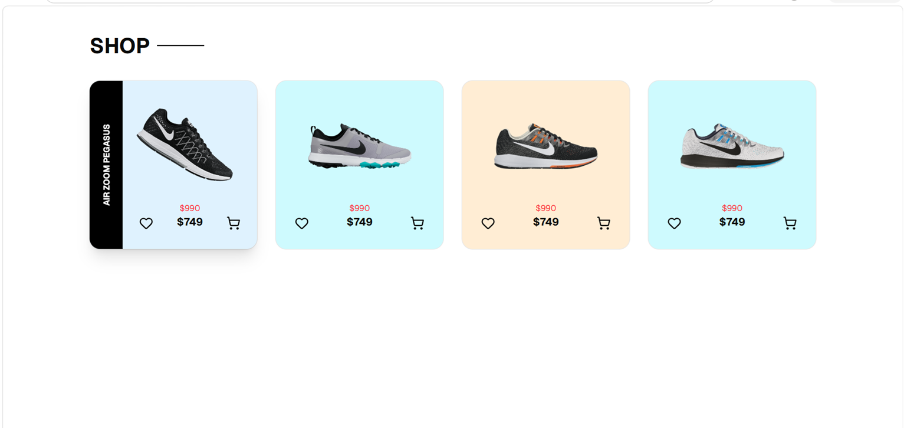

# 🛍️ Product Card

A simple and responsive **Product Card** application built using **React**, **Vite**, **Tailwind CSS**, and **shadcn/ui**. It displays product information in a clean and modern card layout.

---

## 📸 Screenshot

Add your project screenshot inside the **public** folder.

```md

```

---

## ✨ Features

* 🛍️ Product Card Display
* 💲 Product Price
* 📝 Product Description
* 📱 Responsive Design
* 🎨 Modern UI

---

## 🛠️ Tech Stack

* React
* Vite
* Tailwind CSS
* shadcn/ui
* Lucide React

---

## 🚀 Getting Started

Clone the repository

```bash
git clone https://github.com/your-username/product.git
```

Go to the project folder

```bash
cd product
```

Install dependencies

```bash
npm install
```

Start the development server

```bash
npm run dev
```

---

## 📦 Build

```bash
npm run build
```

---

## 👩‍💻 Author

**Srushti Malod**
